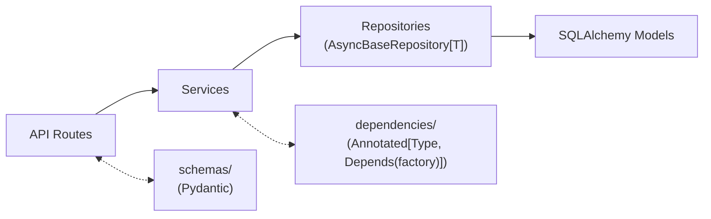
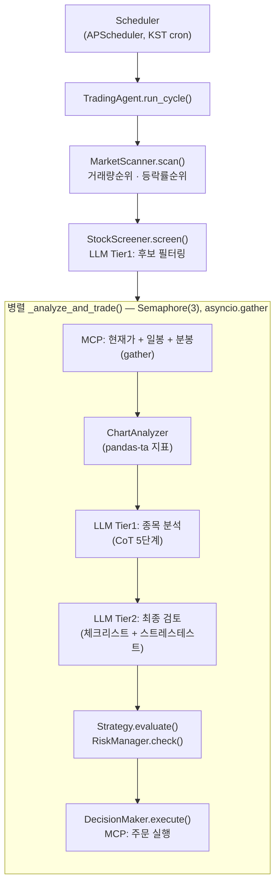
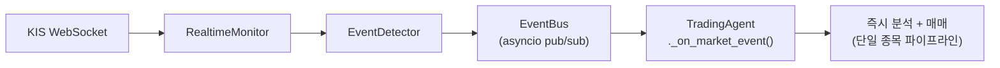

# MOMO Trading

AI 기반 한국 주식(KRX) 자동 매매 시스템.

LLM 다단계 분석(스크리닝 → 기술적 분석 → 최종 검토)과 실시간 WebSocket 이벤트 감지를 결합하여, 장중 자율 매매부터 스윙 오버나이트 보유까지 지원합니다.

## 주요 기능

- **AI 에이전트 파이프라인** — 시장 스캔 → LLM 스크리닝 → 5단계 CoT 분석 → 8항목 체크리스트 최종 검토 → 자동 주문
- **2-Tier LLM 라우팅** — Tier1(빠른 모델: Gemini Flash/Haiku)로 스캔·분석, Tier2(정밀 모델: Claude/Bedrock)로 최종 승인
- **듀얼 전략** — STABLE_SHORT(대형주 보수적) + AGGRESSIVE_SHORT(모멘텀 공격적), 시장 국면별 파라미터 자동 조정
- **실시간 이벤트 트레이딩** — KIS WebSocket → 거래량 급증 / 급등 / 급락 감지 → 즉시 분석 및 매매
- **스윙 모드** — 오버나이트 보유, 종목별 HOLD/SELL 판단, 갭 리스크 체크
- **피드백 학습** — 일일 성과 분석 → 성공/실패 패턴 추출 → 트레이딩 규칙 자동 생성·적용
- **Admin 대시보드** — SSE 실시간 활동 피드, 보유종목·미체결 현황, 설정 변경, 수동 사이클 트리거
- **백테스팅** — 과거 데이터 기반 전략 시뮬레이션

## 기술 스택

| 구분 | 기술 |
|------|------|
| **Web Framework** | FastAPI (async) |
| **ORM** | SQLAlchemy 2.0 (async) |
| **DB Migration** | Alembic |
| **Validation** | Pydantic v2 |
| **기술적 분석** | pandas + pandas-ta |
| **실시간 통신** | WebSocket (KIS), SSE (Admin) |
| **스케줄러** | APScheduler (KRX 장 시간 기준 cron) |
| **증권사 API** | KIS MCP Server (Docker) + KIS REST API 직접 호출 |
| **LLM** | Claude Code CLI / Google Gemini / AWS Bedrock |
| **로깅** | loguru |
| **테스트** | pytest + pytest-asyncio |

## 아키텍처

### 요청 흐름



### 에이전트 파이프라인 (장중)



### 실시간 경로



### 일일 스케줄 (KST)

| 시간 | 작업 |
|------|------|
| 08:50 | 프리마켓 — 전일 피드백 로드, 오버나이트 포지션 확인 |
| 09:05 | 장 시작 — 풀 스캔 → AI 종목 선정 → WebSocket 구독 |
| 11:00, 13:00 | 장중 재스캔 — 신규 기회 탐색 |
| 09:30~14:30 | 30분 간격 — 보유종목 손절/익절 체크 |
| 14:30 | 매수 마감 (데이트레이딩 모드만) |
| 15:10 | 청산 — 데이트레이딩: 전량 매도 / 스윙: 종목별 HOLD/SELL 판단 |
| 15:40 | 장 마감 리뷰 — 성과 분석, AI 피드백 학습, 일일 리포트 생성 |
| 16:00 | 포트폴리오 동기화 — KIS ↔ DB 잔고 대사 |
| 16:30 | 시장 데이터 수집 — 일봉 OHLCV 저장 |

## 프로젝트 구조

```
momo-trading/
├── main.py                     # FastAPI 앱 진입점
├── core/                       # 설정, DB, 이벤트버스, 로깅
├── models/                     # SQLAlchemy ORM 모델
├── repositories/               # AsyncBaseRepository[T] CRUD
├── services/                   # 비즈니스 로직
├── schemas/                    # Pydantic DTO
├── api/routes/                 # REST API 엔드포인트
├── dependencies/               # DI 팩토리 + Type Alias
├── exceptions/                 # ServiceException + ErrorCode
│
├── agent/                      # AI 트레이딩 에이전트
│   ├── trading_agent.py        # 메인 오케스트레이터
│   ├── market_scanner.py       # 시장 스캔 + LLM 스크리닝
│   ├── chart_analyzer.py       # pandas-ta 기술적 분석
│   └── decision_maker.py       # 매매 실행 로직
│
├── strategy/                   # 전략 엔진
│   ├── stable_short.py         # 보수적 단타 (대형주, 5일)
│   ├── aggressive_short.py     # 공격적 모멘텀 (3일)
│   ├── risk_manager.py         # 리스크 관리
│   └── holding_policy.py       # 오버나이트 보유 정책
│
├── analysis/                   # AI 분석
│   ├── llm/                    # LLM 팩토리 + 프롬프트
│   └── feedback/               # 성과 추적 + 학습 규칙
│
├── trading/                    # 증권사 연동
│   ├── mcp_client.py           # KIS MCP SSE 클라이언트
│   ├── kis_api.py              # KIS REST API 직접 호출
│   └── account_manager.py      # 잔고/보유/주문 조회
│
├── realtime/                   # 실시간 모니터링
│   ├── monitor.py              # KIS WebSocket 리스너
│   └── event_detector.py       # 이벤트 감지 (급등/급락/거래량)
│
├── scheduler/                  # APScheduler 잡 관리
├── admin/static/               # Admin 대시보드 (HTML/JS)
├── backtesting/                # 백테스팅 엔진
├── docker/kis-mcp/             # KIS MCP Docker 설정
├── alembic/                    # DB 마이그레이션
└── tests/                      # pytest 테스트
```

## 시작하기

### 사전 요구사항

- Python 3.12+
- [KIS Developers](https://apiportal.koreainvestment.com/) 계정 및 API 키
- [Claude Code CLI](https://docs.anthropic.com/en/docs/claude-code) (LLM 분석용)
- Docker & Docker Compose (KIS MCP 서버 실행용)

### 1. 저장소 클론 및 환경 설정

```bash
git clone https://github.com/jjunmo/momo-trading.git
cd momo-trading

# 가상환경
python -m venv .venv
source .venv/bin/activate  # Windows: .venv\Scripts\activate

# 의존성 설치
pip install -r requirements.txt

# 환경 변수 설정
cp .env.example .env
```

### 2. `.env` 설정

`.env` 파일을 열고 KIS API 키를 입력합니다.

```bash
# === 필수: KIS API 인증 ===
KIS_APP_KEY=your_app_key              # 실전 투자 앱 키
KIS_APP_SECRET=your_app_secret        # 실전 투자 앱 시크릿
KIS_PAPER_APP_KEY=your_paper_key      # 모의 투자 앱 키
KIS_PAPER_APP_SECRET=your_paper_secret # 모의 투자 앱 시크릿
KIS_ACCT_STOCK=your_account_number    # 실전 계좌번호
KIS_PAPER_STOCK=your_paper_account    # 모의 계좌번호
KIS_ACCOUNT_TYPE=VIRTUAL              # VIRTUAL(모의) 또는 REAL(실전)

# === 거래 안전 설정 ===
TRADING_ENABLED=false                 # true로 변경 시 실제 매매 실행
DAY_TRADING_ONLY=false                # true=당일 청산, false=스윙(오버나이트)
AUTONOMY_MODE=SEMI_AUTO               # SEMI_AUTO=승인 필요, AUTONOMOUS=자동 매매

# === 리스크 관리 ===
RISK_APPETITE=MODERATE                # CONSERVATIVE / MODERATE / AGGRESSIVE
MIN_CASH_RATIO=0.05                   # 최소 현금 비중 (5%)
MAX_DAILY_TRADES=30                   # 일일 최대 거래 횟수
# MAX_SINGLE_ORDER_KRW=5000000       # 1회 주문 한도 (미설정 시 AI 자율)
```

> 전체 설정 항목은 `.env.example`을 참조하세요.

### 3. 실행

#### Docker (권장)

```bash
docker compose up
# App: http://localhost:9000
# KIS MCP: http://localhost:3100
# Admin 대시보드: http://localhost:9000/admin
```

#### 로컬 개발

```bash
# KIS MCP 서버를 별도로 실행해야 합니다
docker compose up kis-mcp

# 다른 터미널에서
alembic upgrade head          # DB 마이그레이션
uvicorn main:app --reload     # http://localhost:8000
```

### 4. 첫 실행 체크리스트

1. `TRADING_ENABLED=false` 상태에서 시작 (건조 실행)
2. `KIS_ACCOUNT_TYPE=VIRTUAL`로 모의 투자 먼저 테스트
3. Admin 대시보드(`/admin`)에서 에이전트 활동 모니터링
4. 수동 사이클 트리거로 동작 확인 후 `SCHEDULER_ENABLED=true`

## 트레이딩 전략

### STABLE_SHORT (보수적)

| 항목 | 값 |
|------|-----|
| 대상 | 대형주, ETF, 저변동성 |
| 보유 기간 | 1~5일 |
| 손절 | -2~-3% (시장 국면별) |
| 익절 | +3~+6% (시장 국면별) |
| 최소 신뢰도 | 0.5 |

### AGGRESSIVE_SHORT (공격적)

| 항목 | 값 |
|------|-----|
| 대상 | 모멘텀 급등, 거래량 폭증 |
| 보유 기간 | 수시간~3일 |
| 손절 | -3~-5% (시장 국면별) |
| 익절 | +6~+12% (시장 국면별) |
| 최소 신뢰도 | 0.55 |

전략 파라미터는 시장 국면(BULL/THEME/BEAR)에 따라 자동 조정됩니다.

## Admin 대시보드

`http://localhost:9000/admin`에서 실시간 모니터링 가능합니다.

- **실시간 피드** — SSE 기반 에이전트 활동 스트림 (매수/매도/분석/에러)
- **보유종목 카드** — 현재 포지션, 수익률, 미실현 손익
- **미체결 주문** — 대기 중인 주문 현황
- **일일 리포트** — 승률, 손익, Sharpe ratio, AI 학습 내용
- **설정 패널** — 런타임 설정 변경 (재시작 불필요)
- **수동 트리거** — 장 외 시간에도 사이클 실행 가능

## 테스트

```bash
pytest tests/ -v
pytest tests/api/test_health.py -v    # 단일 파일
```

인메모리 SQLite(`sqlite+aiosqlite://`)로 실행되며, KIS API 호출 없이 독립 테스트 가능합니다.

## 면책 조항

이 프로젝트는 **교육 및 연구 목적**으로 제작되었습니다.

- 이 소프트웨어를 사용한 투자 손실에 대해 개발자는 어떠한 책임도 지지 않습니다.
- 실전 투자 전 반드시 모의 투자(`KIS_ACCOUNT_TYPE=VIRTUAL`)로 충분히 테스트하세요.
- 자동 매매 시스템은 예상치 못한 시장 상황에서 손실을 발생시킬 수 있습니다.
- KIS API 사용 시 [한국투자증권 API 이용약관](https://apiportal.koreainvestment.com/)을 준수하세요.

## License

MIT
