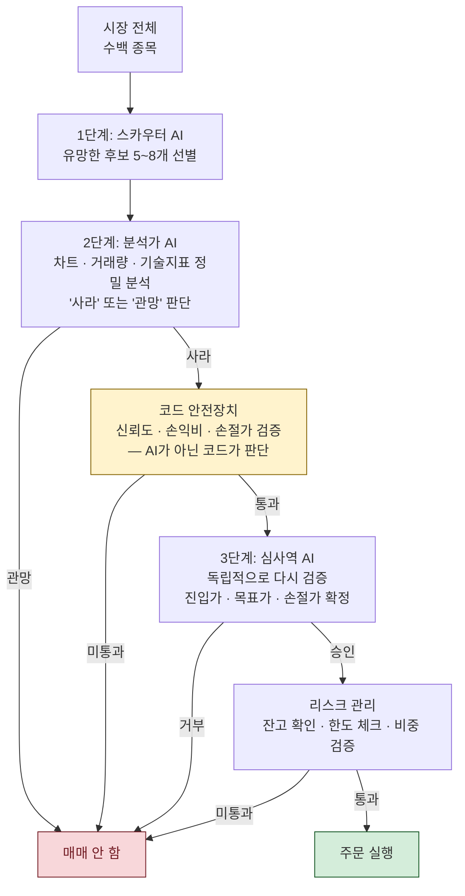
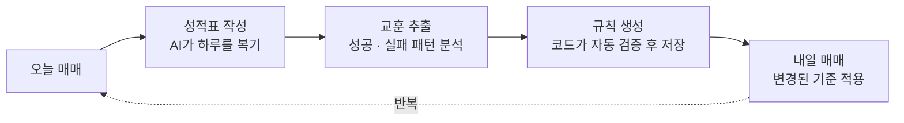
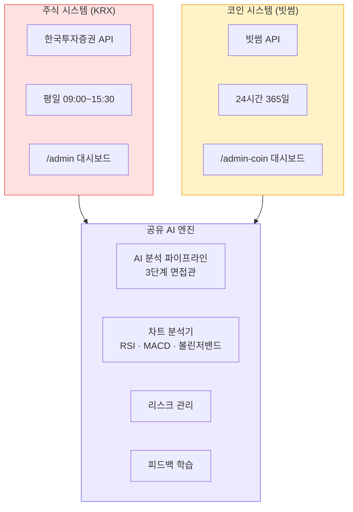

# MOMO Trading

> AI가 시장을 스캔하고, 분석하고, 주문까지 — 한국 주식(KRX)과 암호화폐(빗썸)를 자동으로 매매하는 트레이딩 봇

---

## MOMO는 이런 시스템입니다

- **3명의 AI가 팀을 이루어 매매합니다** — 스카우터가 수백 종목을 훑고, 분석가가 정밀 검토하고, 심사역이 독립적으로 다시 검증합니다. 사람이 아닌 코드가 최종 안전장치 역할을 합니다.
- **주식과 코인, 두 개의 독립 시스템** — 한국투자증권(KIS) API로 주식을, 빗썸 API로 암호화폐를 각각 매매합니다. 설정, 잔고, 데이터가 완전히 분리되어 서로 영향을 주지 않습니다.
- **매일 스스로 학습합니다** — 하루가 끝나면 AI가 성적표를 작성하고, 성공/실패 패턴을 분석하여 다음 날 매매 규칙을 자동으로 조정합니다.
- **반자동 또는 완전자동** — 모든 매매를 사람이 승인하는 반자동(SEMI_AUTO) 모드와, AI가 스스로 판단하는 완전자동(AUTONOMOUS) 모드를 선택할 수 있습니다.

---

## 어떻게 동작하나요?

### 3단계 AI 판단 과정

하나의 종목이 실제로 매수되기까지 3단계의 AI 면접과 코드 레벨 안전장치를 통과해야 합니다.



> **핵심**: AI가 아무리 "사라"고 해도, 코드 레벨 안전장치(신뢰도 부족, 손익비 미달, 손절가 미설정)에서 자동 차단됩니다.

---

### 하루 일과 — 주식 vs 코인

주식은 장 시간에만 매매하지만, 코인은 24시간 쉬지 않고 돌아갑니다.

#### 주식 (KRX) — 평일 09:00~15:30

```mermaid
gantt
    title 주식 하루 일정 (KST)
    dateFormat HH:mm
    axisFormat %H:%M

    section 장전
    사전 준비 — 어제 메모 확인    :prep, 08:50, 10m

    section 장중
    스캔 + 매매              :scan1, 09:05, 25m
    보유종목 점검              :check1, 09:30, 60m
    재스캔 + 매매             :scan2, 11:00, 25m
    보유종목 점검              :check2, 11:30, 90m
    재스캔 + 매매             :scan3, 13:00, 25m
    보유종목 점검              :check3, 13:30, 60m
    매수 마감 — 오늘 쇼핑 끝   :crit, cutoff, 14:30, 5m

    section 장마감
    강제 청산 — 문 닫기 전 정리   :crit, liq, 15:10, 10m
    성적표 작성 — 하루 일기      :review, 15:40, 20m
    포트폴리오 정산             :sync, 16:00, 10m
```



#### 코인 (빗썸) — 24시간 365일

```mermaid
gantt
    title 코인 24시간 스케줄 (KST)
    dateFormat HH:mm
    axisFormat %H:%M

    section 스캔 사이클
    스캔 + 매매 1   :crit, s1, 00:00, 30m
    스캔 + 매매 2   :crit, s2, 04:00, 30m
    스캔 + 매매 3   :crit, s3, 08:00, 30m
    스캔 + 매매 4   :crit, s4, 12:00, 30m
    스캔 + 매매 5   :crit, s5, 16:00, 30m
    스캔 + 매매 6   :crit, s6, 20:00, 30m

    section 보유 점검
    보유종목 점검 1   :active, c1, 02:00, 15m
    보유종목 점검 2   :active, c2, 06:00, 15m
    보유종목 점검 3   :active, c3, 10:00, 15m
    보유종목 점검 4   :active, c4, 14:00, 15m
    보유종목 점검 5   :active, c5, 18:00, 15m
    보유종목 점검 6   :active, c6, 22:00, 15m
```



#### 시간대별 하는 일

| 시간 | 무슨 일 | 비유 |
|------|---------|------|
| **사전 준비** | 어제 성적표 피드백 로드, 규칙 세팅 | 출근해서 어제 메모 확인 |
| **스캔 + 매매** | AI 3단계 면접관 전체 가동 | 후보 뽑고 → 분석 → 검증 → 주문 |
| **보유종목 점검** | 이미 산 종목의 상태 확인 (손절/익절) | 가지고 있는 물건 가격 체크 |
| **매수 마감** | 더 이상 새로 사지 않음 (주식만) | "오늘 쇼핑 끝" |
| **강제 청산** | 당일 매매분 전량 매도 (주식만) | "가게 문 닫기 전에 정리" |
| **성적표** | AI가 오늘 결과 복기 → 내일 규칙 생성 | 하루 끝나고 일기 쓰기 |

---

### 매일 학습하는 AI

매매가 끝나면 AI가 성적표를 작성하고, 다음 날 더 나은 기준으로 돌아옵니다.



AI가 조정할 수 있는 항목:

| 항목 | 의미 | 예시 |
|------|------|------|
| 최소 신뢰도 | "몇 % 이상 확신해야 사는가" | "75% 이상만 사자" |
| 손절 기준 | "얼마나 떨어지면 파는가" | "3% 떨어지면 팔자" |
| 익절 기준 | "얼마나 오르면 파는가" | "5% 올랐으면 팔자" |
| 손익비 | "위험 대비 기대 수익 비율" | "최소 1.2배 벌어야 함" |

> 단, AI가 제안한 규칙도 코드가 허용 범위 안에서만 적용됩니다. 극단적인 값은 자동으로 보정됩니다.

---

## 주식 vs 코인 — 두 개의 독립 시스템

|  | 주식 (KRX) | 코인 (빗썸) |
|---|---|---|
| **시장 시간** | 평일 09:00~15:30 | 24시간 365일 |
| **증권사** | 한국투자증권 (KIS API) | 빗썸 (Bithumb API) |
| **스캔 주기** | 장 시작 + 장중 재스캔 | 4시간마다 |
| **전략** | 보수적 단타 + 공격적 모멘텀 | 코인 전용 전략 |
| **AI 분석** | 동일한 3단계 파이프라인 | 동일 (코인 전용 프롬프트) |
| **실시간 감지** | WebSocket 급등/급락/거래량 | WebSocket 가격/주문/잔고 |
| **관리자 화면** | `/admin` | `/admin-coin` |
| **데이터베이스** | 주식 전용 테이블 | 코인 전용 테이블 (완전 분리) |
| **환경 설정** | `TRADING_*` 변수 | `CRYPTO_*` 변수 (독립) |



> 주식과 코인은 AI 엔진과 인프라를 공유하지만, **설정 · 잔고 · 데이터 · 관리자 화면이 완전히 분리**되어 있어 서로 영향을 주지 않습니다.

---

## 주요 기능

| 기능 | 설명 |
|------|------|
| **AI 자동 매매** | 반자동(승인 필요) 또는 완전자동 선택 가능 |
| **실시간 이벤트 감지** | 거래량 폭증, 급등/급락 발생 시 즉시 분석 및 대응 |
| **리스크 관리** | 손절/익절 자동 설정, 일일 거래 한도, 최소 현금 비중 |
| **피드백 학습** | 매일 성과 분석 → 성공/실패 패턴 추출 → 규칙 자동 개선 |
| **관리자 대시보드** | 실시간 활동 모니터링, 보유종목 현황, 수동 개입 가능 |
| **듀얼 전략** | 보수적(대형주) + 공격적(모멘텀) 전략, 시장 국면별 자동 조정 |
| **백테스팅** | 과거 데이터 기반 전략 시뮬레이션 |
| **2-Tier LLM** | Claude Code 또는 Codex CLI를 Tier1(빠른 스캔)/Tier2(정밀 검토)로 활용 |

---

## 시작하기

```bash
git clone https://github.com/jjunmo/momo-trading.git
cd momo-trading
cp .env.example .env          # 환경 변수 편집 (KIS API 키, LLM 설정)
docker compose up              # http://localhost:9000/admin
```

> 처음에는 반드시 `TRADING_ENABLED=false` + `KIS_ACCOUNT_TYPE=VIRTUAL`(모의 투자)로 시작하세요.

상세 설정 방법, 코인 전용 설정, 로컬 개발 환경 구성은 **[설치 가이드](docs/setup-guide.md)**를 참조하세요.

---

## 상세 문서

| 문서 | 설명 |
|------|------|
| **[설치 가이드](docs/setup-guide.md)** | 환경 설정, Docker/로컬 실행, 첫 실행 체크리스트 |
| **[주식 시스템 상세](docs/stock-system.md)** | KIS 연동, 전략 파라미터, 실시간 이벤트, 프로젝트 구조 |
| **[코인 시스템 상세](docs/crypto-system.md)** | 빗썸 연동, 24/7 운영, 시장 국면, DB 구조 |
| **[시스템 아키텍처](docs/architecture.md)** | 전체 파이프라인, 검증 게이트, 피드백 루프 (개발자용) |
| **[코인 아키텍처](docs/crypto-architecture.md)** | 도메인 구조, 프로토콜, 거래 플로우 (개발자용) |
| **[LLM 아키텍처](docs/llm-architecture.md)** | AI 엔진 구조, Claude/Codex 연동 (개발자용) |
| **[트레이딩 에이전트](docs/trading-agent-architecture.md)** | 매매 파이프라인, 스케줄러, 피드백 (개발자용) |

---

## 면책 조항

> **이 프로젝트는 교육 및 연구 목적으로 제작되었습니다.**
>
> - 이 소프트웨어를 사용한 투자 손실에 대해 개발자는 어떠한 책임도 지지 않습니다.
> - 실전 투자 전 반드시 모의 투자(`KIS_ACCOUNT_TYPE=VIRTUAL`)로 충분히 테스트하세요.
> - 자동 매매 시스템은 예상치 못한 시장 상황에서 손실을 발생시킬 수 있습니다.
> - 각 증권사 API 이용약관을 준수하세요.

## License

MIT
