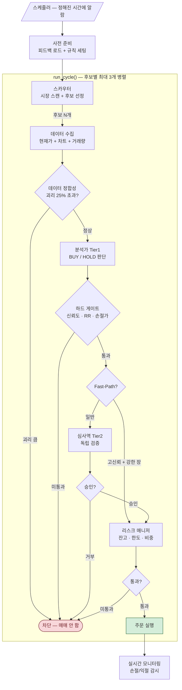
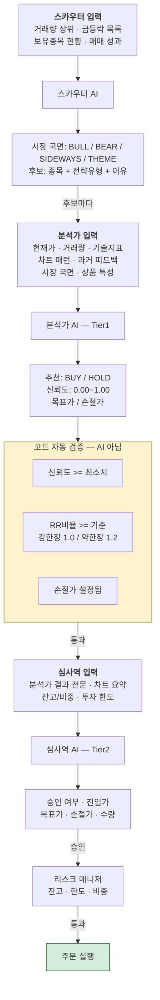
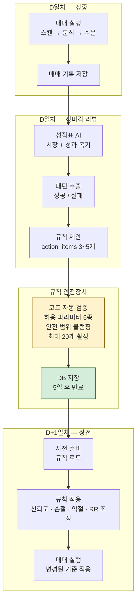
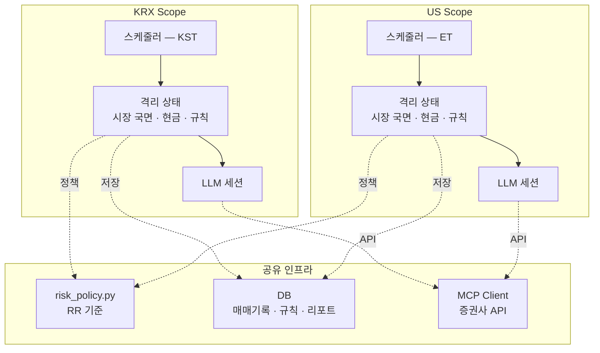

# MOMO Trading — 시스템 아키텍처

> **개발자 대상 기술 아키텍처 문서입니다.** 일반 개요는 [README](../README.md), 도메인별 상세는 [주식 시스템](stock-system.md) · [코인 시스템](crypto-system.md)을 참조하세요.

> 이 문서는 단기매매 자동화 시스템의 전체 구조를 Mermaid 다이어그램으로 설명합니다.
> 주식 용어를 최소화하고, 개선된 계약 정렬(RR 단일 기준, Tier1 BUY/HOLD 계약, confidence 정의) 반영 상태 기준입니다.

---

## 1. 전체 파이프라인 흐름

스케줄러가 알람을 울리면 `run_cycle()` 하나의 함수 안에서 **스캔 → 분석 → 검증 → 주문**이 연쇄 실행됩니다.



### 핵심 포인트
- **3단계 면접관**: 스카우터 → 분석가 → 심사역, 각각 독립적으로 AI가 판단
- **하드 게이트**: AI가 아무리 "사라"고 해도 코드 레벨에서 기준 미달이면 자동 차단
- **Fast-Path**: 신뢰도 80% 이상 + 강한 장세 + 일반 종목이면 심사역 생략 (속도 우선)
- **RR비율 기준**: `trading/risk_policy.py`에서 단일 관리 (강한 장 1.0:1, 약한 장 1.2:1)

---

## 2. 하루 타임라인

### KRX (한국 시장)

```mermaid
gantt
    title KRX 하루 일정 (KST)
    dateFormat HH:mm
    axisFormat %H:%M

    section 장전
    사전 준비              :prep, 08:50, 10m

    section 장중
    스캔 + 매매 1          :scan1, 09:05, 25m
    보유 점검              :check1, 09:30, 5m
    보유 점검              :check2, 10:30, 5m
    스캔 + 매매 2          :scan2, 11:00, 25m
    보유 점검              :check3, 11:30, 5m
    보유 점검              :check4, 12:30, 5m
    스캔 + 매매 3          :scan3, 13:00, 25m
    보유 점검              :check5, 13:30, 5m
    매수 마감              :crit, cutoff, 14:30, 5m

    section 장마감
    강제 청산              :crit, liq, 15:10, 10m
    성적표 작성            :review, 15:40, 20m
    포트폴리오 정산         :sync, 16:00, 10m
    차트 데이터 수집        :data, 16:30, 10m
```



### US (미국 시장, 프리마켓 활성화)

```mermaid
gantt
    title US 하루 일정 (ET 기준, 프리마켓 활성)
    dateFormat HH:mm
    axisFormat %H:%M

    section 프리마켓
    사전 준비              :prep, 03:50, 10m
    프리마켓 스캔 + 매매    :scan1, 04:05, 25m

    section 장중
    보유 점검              :check1, 04:30, 5m
    보유 점검              :check2, 05:30, 5m
    보유 점검              :check3, 06:30, 5m
    보유 점검              :check4, 07:30, 5m
    보유 점검              :check5, 08:30, 5m
    보유 점검              :check6, 09:30, 5m
    보유 점검              :check7, 10:30, 5m
    재스캔 + 매매          :scan2, 11:00, 25m
    보유 점검              :check8, 11:30, 5m
    보유 점검              :check9, 12:30, 5m
    재스캔 + 매매          :scan3, 13:00, 25m
    보유 점검              :check10, 13:30, 5m
    보유 점검              :check11, 14:30, 5m

    section 장마감
    강제 청산              :crit, liq, 15:40, 10m
    성적표 작성            :review, 16:10, 20m
    포트폴리오 정산         :sync, 16:30, 10m
    일봉 데이터 수집        :data, 17:00, 10m
```



> KST 환산: ET + 14시간 (서머타임 기준). 예: ET 04:00 = KST 18:00

### 각 시간대에 하는 일

| 시간 | 무슨 일 | 비유 |
|------|---------|------|
| **사전 준비** | 어제 성적표 피드백 로드, 규칙 세팅 | 출근해서 어제 메모 확인 |
| **스캔 + 매매** | AI 3단계 면접관 전체 가동 | 후보 뽑고 → 분석 → 검증 → 주문 |
| **보유종목 점검** | 이미 산 것의 상태 확인 (손절/익절) | 가지고 있는 물건 가격 체크 |
| **신규 매수 마감** | 더 이상 새로 안 삼 | "오늘 쇼핑 끝" |
| **강제 청산** | 안 판 거 전부 팔기 | "가게 문 닫기 전에 정리" |
| **성적표** | AI가 오늘 결과 복기 → 내일 규칙 생성 | 하루 끝나고 일기 쓰기 |

---

## 3. 데이터 흐름 + 검증 게이트

각 AI 단계에서 **어떤 데이터를 받고, 어떤 형식으로 답하는지** 보여줍니다.



### 검증 게이트 상세

```
분석가(Tier1) 응답
    │
    ├── HOLD → 종료 (기회 없음)
    ├── BUY + 신뢰도 < 최소치 → 차단 (규칙 미달)
    ├── BUY + RR비율 < 기준 → 차단 (위험 대비 이익 부족)
    ├── BUY + 손절가 없음 → 차단 (안전장치 없음)
    └── BUY + 모두 통과 → 심사역(Tier2)으로 진행
```

---

## 4. 피드백 루프 — 매일 학습하는 구조



### 피드백 루프 핵심

| 단계 | 비유 | 설명 |
|------|------|------|
| 매매 실행 | 시험 보기 | AI가 판단하고 주문 |
| 성적표 작성 | 시험 복기 | "오늘 뭘 잘했고 뭘 틀렸나" |
| 규칙 제안 | 공부 계획 세우기 | "내일은 이렇게 하자" |
| 안전장치 | 선생님 검토 | 극단적인 계획은 코드가 자동 수정 |
| 다음날 적용 | 계획대로 공부 | 변경된 기준으로 매매 |

### AI가 조정할 수 있는 파라미터 (6종)

| 파라미터 | 뜻 | 허용 범위 | 예시 |
|---------|------|----------|------|
| `min_confidence` | 최소 신뢰도 | 0.50 ~ 0.90 | "75% 이상만 사자" |
| `stop_loss_pct` | 손절 기준 % | -8% ~ -1% | "3% 떨어지면 팔자" |
| `take_profit_pct` | 익절 기준 % | 2% ~ 15% | "5% 올랐으면 팔자" |
| `rr_floor` | 최소 이익/위험 비율 | 0.8 ~ 3.0 | "최소 1.2배 벌어야 함" |
| `revalidate_rr_ratio` | 비율 재검증 on/off | 0 / 1 | 상시 켜져 있음 |
| `require_stop_loss` | 손절가 필수 on/off | 0 / 1 | 상시 켜져 있음 |

---

## 5. 시장별 격리 구조

KRX(한국)와 US(미국)는 **완전히 독립된 런타임**으로 동작합니다.



### 격리되는 것 vs 공유되는 것

| 구분 | KRX/US 각각 독립 | 공유 |
|------|-----------------|------|
| 스케줄 시간 | ✅ | |
| 시장 국면 판단 | ✅ | |
| 현금 잔고 추적 | ✅ | |
| 트레이딩 규칙 | ✅ (scope별 저장) | |
| LLM 세션 | ✅ | |
| RR 기준 정책 | | ✅ `risk_policy.py` |
| 데이터베이스 | | ✅ |
| 증권사 API | | ✅ |

---

## 6. 주요 파일 맵

```
momo-trading/
├── scheduler/
│   └── scheduler.py          ← ⏰ 알람 시계 (언제 뭘 할지)
│
├── agent/
│   ├── trading_agent.py      ← 🧠 메인 두뇌 (run_cycle, 3단계 면접관)
│   ├── market_scanner.py     ← 🔍 스카우터 (시장 스캔)
│   └── decision_maker.py     ← ✅ 주문 실행기
│
├── analysis/
│   ├── llm/prompts/
│   │   ├── market_scan.py    ← 스카우터 AI 지침서
│   │   ├── stock_analysis.py ← 분석가 AI 지침서 (Tier1)
│   │   ├── final_review.py   ← 심사역 AI 지침서 (Tier2)
│   │   ├── daily_plan.py     ← 성적표 AI 지침서
│   │   ├── risk_assessment.py← 리스크 평가 지침서
│   │   └── risk_tuning.py    ← AI 자율 한도 지침서
│   ├── chart_analyzer.py     ← 📊 차트 분석기 (지표 계산)
│   └── feedback/
│       └── trading_rules.py  ← 📝 규칙 엔진 (피드백 → 코드 강제)
│
├── strategy/
│   ├── risk_manager.py       ← 🛡️ 리스크 매니저
│   ├── stable_short.py       ← 안정형 전략
│   └── aggressive_short.py   ← 공격형 전략
│
├── trading/
│   ├── risk_policy.py        ← 📋 RR 기준 단일 소스 (공용 정책)
│   ├── market_profile.py     ← 시장별 설정 (KRX/US)
│   ├── product_policy.py     ← 상품 분류 정책 (레버리지 등)
│   └── mcp_client.py         ← 🔌 증권사 API 연결
│
└── docs/
    └── architecture.md       ← 📖 이 문서
```
