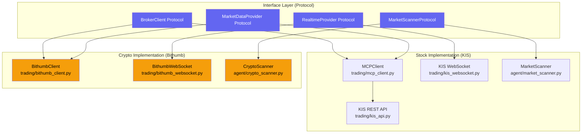
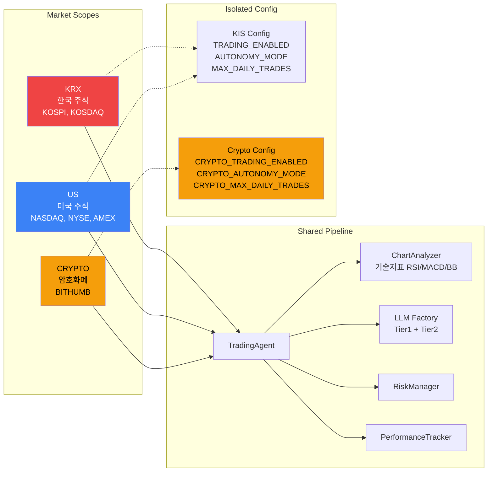
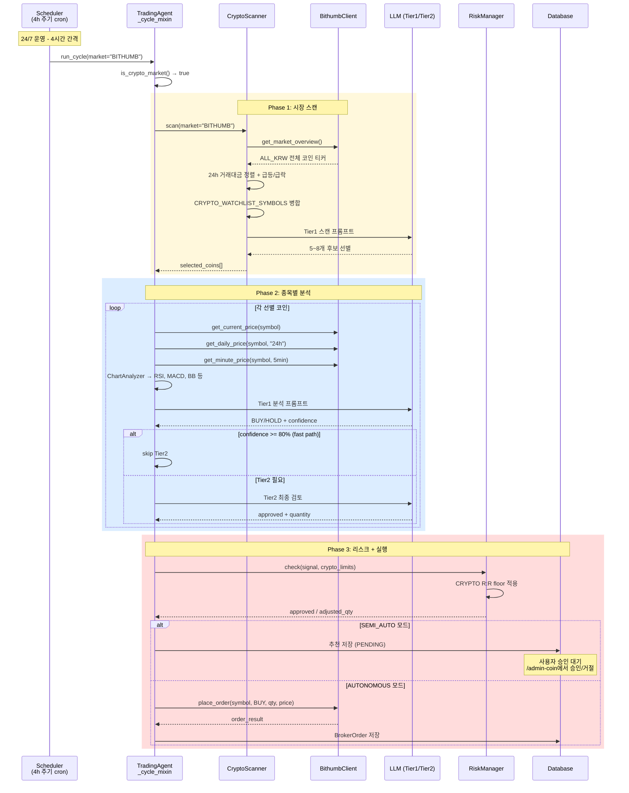
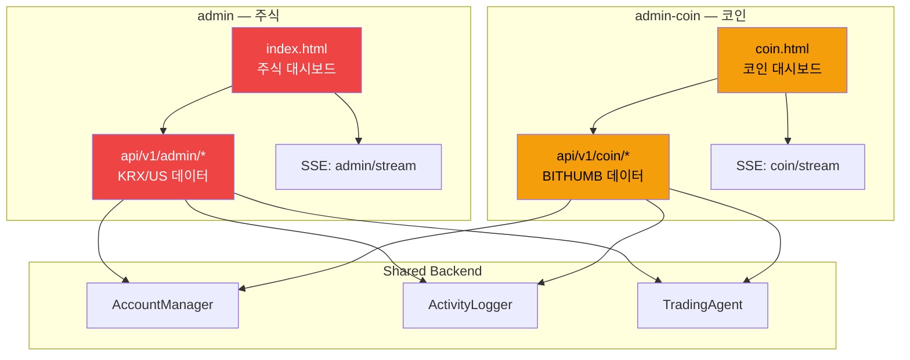
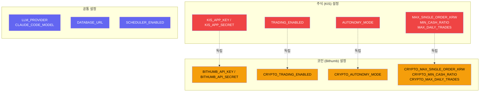

# Crypto (Bithumb) Domain Architecture

> **개발자 대상 코드 레벨 아키텍처 문서입니다.** 일반 개요는 [README](../README.md), 사용자 관점 상세는 [코인 시스템 상세](crypto-system.md)를 참조하세요.

## 1. 도메인 구조

## 2. Market Scope 분리 구조

## 3. 코인 거래 플로우

## 4. 코인 Admin 페이지 구조

## 5. 코인 스케줄 타임라인

```mermaid
gantt
    title 코인 24/7 스케줄 (KST)
    dateFormat HH:mm

    section 주기 스캔
    스캔 사이클 1    :crit, 00:00, 30min
    스캔 사이클 2    :crit, 04:00, 30min
    스캔 사이클 3    :crit, 08:00, 30min
    스캔 사이클 4    :crit, 12:00, 30min
    스캔 사이클 5    :crit, 16:00, 30min
    스캔 사이클 6    :crit, 20:00, 30min

    section 보유 점검
    점검 1           :active, 01:00, 15min
    점검 2           :active, 03:00, 15min
    점검 3           :active, 05:00, 15min
    점검 4           :active, 07:00, 15min
    점검 5           :active, 09:00, 15min
    점검 6           :active, 11:00, 15min

    section 일일 리뷰
    24h 성과 리뷰    :done, 00:00, 30min
```

## 6. 환경변수 분리 구조

