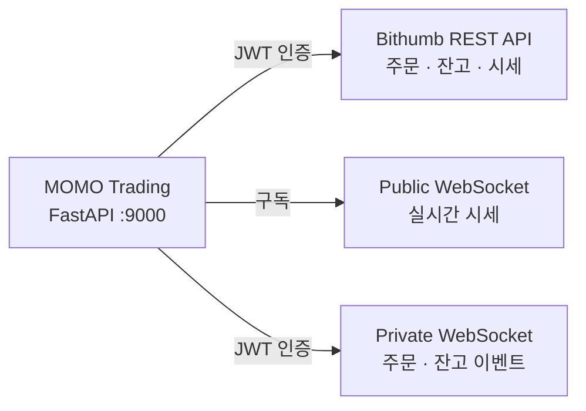
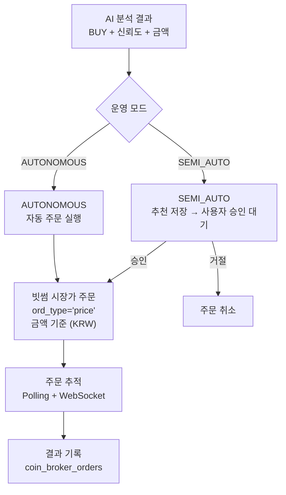

# 코인(빗썸) 시스템 상세

> 일반 개요는 [README](../README.md), 코드 레벨 아키텍처는 [crypto-architecture.md](crypto-architecture.md)를 참조하세요.

---

## 1. 빗썸 API 연동

코인 매매는 빗썸(Bithumb) API를 통해 이루어집니다.

| 방식 | 용도 | 인증 |
|------|------|------|
| **REST API** | 주문 실행, 잔고 조회, 시세, 캔들 | JWT Bearer (API Key + Secret) |
| **Public WebSocket** | 실시간 시세 (ticker, trade, orderbook) | 불필요 |
| **Private WebSocket** | 주문 상태 변경, 잔고 변동 | JWT Bearer |



### 주요 특이사항 (주식과의 차이)

| 항목 | 주식 (KIS) | 코인 (빗썸) |
|------|-----------|------------|
| 인증 방식 | OAuth2 토큰 | JWT Bearer |
| 수량 단위 | 정수 (주) | 소수점 8자리 (0.00000001) |
| 주문 기준 | 수량 (몇 주) | 금액 (얼마어치, KRW) |
| 최소 주문 | 1주 | 5,000원 |
| Rate Limit | 1초 20건 | Public 10 / Private 5 세마포어 |
| 데이터 정렬 | oldest-first | newest-first → 내부 정렬 필요 |

---

## 2. 24/7 운영 모델

코인은 장 시간 개념이 없습니다. 24시간 365일 스캔과 매매가 이루어집니다.

### 스캔 사이클 (기본 4시간)

```
00:00 → 04:00 → 08:00 → 12:00 → 16:00 → 20:00 → (반복)
```

각 스캔에서:
1. Discovery Universe 조회 — 거래대금 상위 30개 코인 (6시간 캐시)
2. Watchlist 심볼 병합 — `CRYPTO_WATCHLIST_SYMBOLS`에 설정된 코인
3. AI Tier1 스캔 — 시장 국면 판단 + 5~8개 후보 선별
4. 후보별 정밀 분석 — 차트·기술지표 기반 BUY/HOLD 판단
5. 리스크 검증 + 주문 실행

### 보유종목 점검 (기본 2시간)

스캔 사이클과 별도로 보유 중인 코인의 상태를 점검합니다:
- 현재가 조회 + 미실현 손익 계산
- 손절/익절 조건 확인
- Admin 대시보드에 상태 업데이트

### 체크포인트 리포트

스캔 사이클 전후에 AI가 해당 기간의 성과를 복기합니다:
- 기간 내 총 사이클 수, 분석 수, 매매 수
- 승률, 총 손익, 미실현 손익
- 시장 요약, 교훈, 다음 기간 계획

---

## 3. 시장 국면

코인 시장은 4가지 국면으로 분류되며, AI가 각 스캔에서 판단합니다:

| 국면 | 의미 | AI 행동 변화 |
|------|------|------------|
| **BULL_RUN** | 강세장 — 대부분 코인 상승 | 적극적 매수, RR 기준 완화 (2.0) |
| **BEAR_MARKET** | 약세장 — 대부분 코인 하락 | 신중한 매수, RR 기준 강화 (1.5) |
| **CONSOLIDATION** | 횡보장 — 뚜렷한 방향 없음 | 선별적 매수, 기본 RR 기준 |
| **ALTSEASON** | 알트코인 시즌 — 비트코인 대비 알트 강세 | 알트코인 위주 탐색 |

### 스트레스 테스트 범위

Tier2 최종 검토에서 적용하는 스트레스 테스트 범위가 주식보다 넓습니다:

| | 주식 | 코인 |
|---|---|---|
| 하락 시나리오 | -3%~-5% | -7%~-10% |
| 변동성 가정 | 낮음 | 높음 |

이는 코인 시장의 높은 변동성을 반영합니다.

---

## 4. 주문 흐름



**주문 특이사항:**
- 매수 주문은 금액(KRW) 기준으로 실행 (`suggested_amount_krw`가 기준)
- 시장가(market price) 주문이 기본
- 최소 주문 금액: 5,000원

---

## 5. Admin-coin 대시보드

`http://localhost:9000/admin-coin`에서 코인 전용 모니터링이 가능합니다.

주식 대시보드(`/admin`)와 완전히 분리된 별도 페이지입니다.

| 기능 | 설명 |
|------|------|
| 시스템 상태 | 빗썸 연결 상태, 스케줄러, 에이전트 상태 |
| 실시간 피드 | SSE 기반 활동 스트림 (스캔, 분석, 주문, 에러) |
| 추천 목록 | SEMI_AUTO 모드: 대기 중인 매수 추천 승인/거절 |
| 보유종목 | 현재 포지션, 수익률, 미실현 손익 |
| 체크포인트 리포트 | 기간별 성과 리포트, KPI, 활동 로그 |
| 수동 트리거 | 스캔 실행, 리포트 생성 등 |

---

## 6. 데이터베이스 격리

코인 데이터는 주식과 완전히 분리된 10개의 전용 테이블을 사용합니다.
주식 테이블과 외래 키(FK) 관계가 없어 서로 영향을 주지 않습니다.

| 테이블 | 용도 |
|--------|------|
| `coin_assets` | 추적 대상 코인 목록 |
| `coin_holdings` | 현재 보유 포지션 |
| `coin_analysis_results` | Tier1/Tier2 분석 결과 |
| `coin_recommendations` | 대기 중인 매수 추천 (SEMI_AUTO) |
| `coin_broker_orders` | 빗썸 주문 기록 |
| `coin_orders` | 내부 주문 추상화 |
| `coin_trade_results` | 청산된 포지션 (진입가, 종료가, 손익) |
| `coin_daily_reports` | 체크포인트 리포트 |
| `coin_trading_rules` | AI 피드백 규칙 |
| `coin_activity_logs` | 활동 감사 로그 |

---

## 7. 환경변수 참조

### 빗썸 API 인증

| 변수 | 설명 |
|------|------|
| `BITHUMB_API_KEY` | API 키 |
| `BITHUMB_API_SECRET` | API 시크릿 |
| `BITHUMB_WS_URL_PUBLIC` | Public WebSocket URL |
| `BITHUMB_WS_URL_PRIVATE` | Private WebSocket URL |

### 코인 운영 설정

| 변수 | 기본값 | 설명 |
|------|--------|------|
| `CRYPTO_ENABLED` | false | 코인 시스템 마스터 스위치 |
| `CRYPTO_TRADING_ENABLED` | false | 실제 주문 실행 여부 |
| `CRYPTO_AUTONOMY_MODE` | SEMI_AUTO | 운영 모드 |
| `CRYPTO_SCAN_INTERVAL_HOURS` | 4 | 스캔 주기 (시간) |
| `CRYPTO_HOLDINGS_CHECK_INTERVAL_HOURS` | 2 | 보유 점검 주기 (시간) |
| `CRYPTO_WATCHLIST_SYMBOLS` | BTC,ETH,XRP,SOL | 시드 심볼 |
| `CRYPTO_SCAN_LIMIT` | 15 | 스캔당 최대 후보 수 |

### 코인 리스크 관리

| 변수 | 기본값 | 설명 |
|------|--------|------|
| `CRYPTO_MAX_POSITION_PCT` | 20.0 | 종목당 최대 비중 (%) |
| `CRYPTO_MIN_CASH_RATIO` | 0.10 | 최소 현금 비중 (10%) |
| `CRYPTO_MAX_SINGLE_ORDER_KRW` | 0 | 1회 주문 한도 (0=무제한) |
| `CRYPTO_MAX_DAILY_TRADES` | 0 | 일일 거래 한도 (0=무제한) |

### 코인 Discovery

| 변수 | 기본값 | 설명 |
|------|--------|------|
| `CRYPTO_DYNAMIC_DISCOVERY_ENABLED` | true | 동적 유니버스 탐색 |
| `CRYPTO_DISCOVERY_REFRESH_MINUTES` | 360 | 유니버스 갱신 주기 (분) |
| `CRYPTO_DISCOVERY_UNIVERSE_SIZE` | 30 | 유니버스 크기 |

### 코인 전용 LLM (선택)

| 변수 | 설명 |
|------|------|
| `CRYPTO_LLM_PROVIDER` | 코인 전용 LLM (미설정 시 주식과 동일) |
| `CRYPTO_LLM_MODEL_TIER1_SCAN` | Tier1 스캔 모델 |
| `CRYPTO_LLM_MODEL_TIER1_ANALYSIS` | Tier1 분석 모델 |
| `CRYPTO_LLM_MODEL_TIER2` | Tier2 모델 |

> 전체 설정 항목과 프로필별 예시는 `.env.example-coin`을 참조하세요.

---

## 8. 실행 방법

### 코인 전용 실행

```bash
./start-coin.sh               # 포그라운드
./start-coin.sh -d             # 데몬 모드
```

`start-coin.sh`는 다음을 자동 수행합니다:
1. venv 활성화
2. 환경변수 확인 (`CRYPTO_ENABLED=true`, `BITHUMB_API_KEY` 존재)
3. 빗썸 Preflight — DNS 확인 + API 연결 테스트
4. DB 마이그레이션
5. uvicorn 실행

### 주식 + 코인 동시 실행

```bash
docker compose up              # 또는 start.sh
```

`.env`에서 `CRYPTO_ENABLED=true`로 설정하면 주식과 코인이 동시에 운영됩니다.
