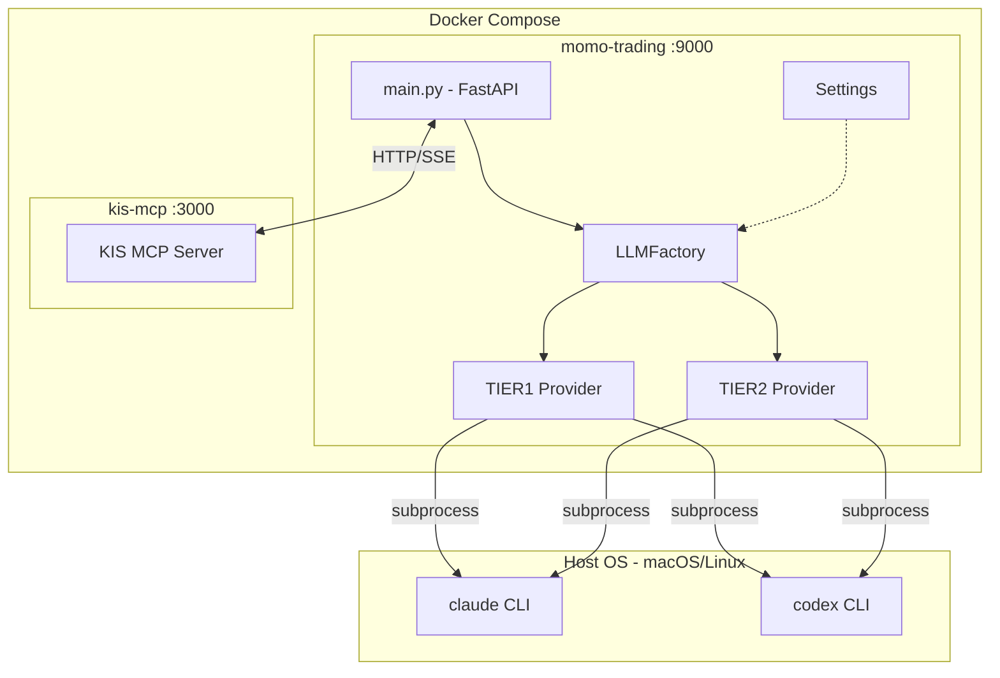
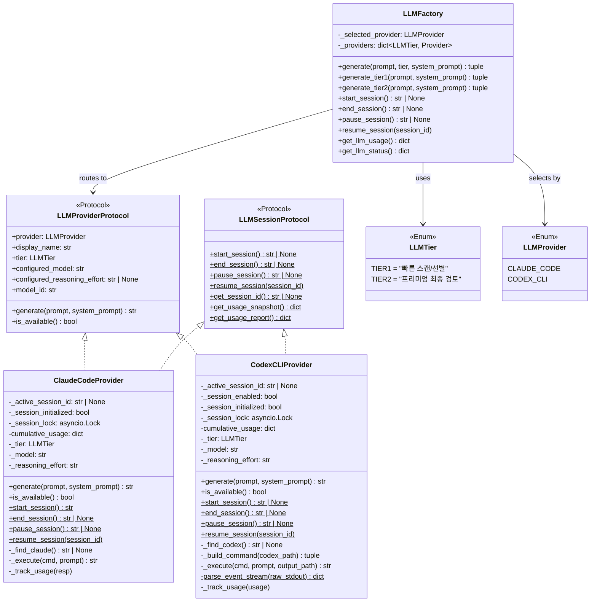
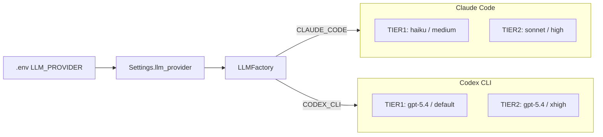
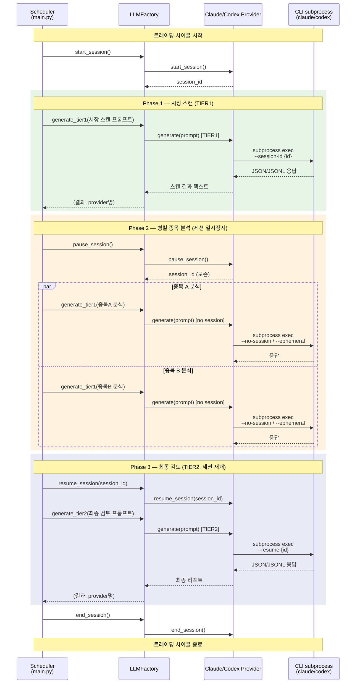
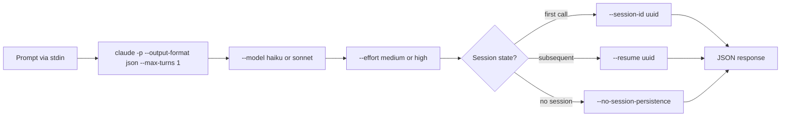
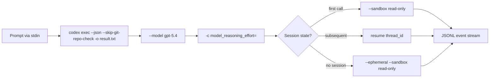
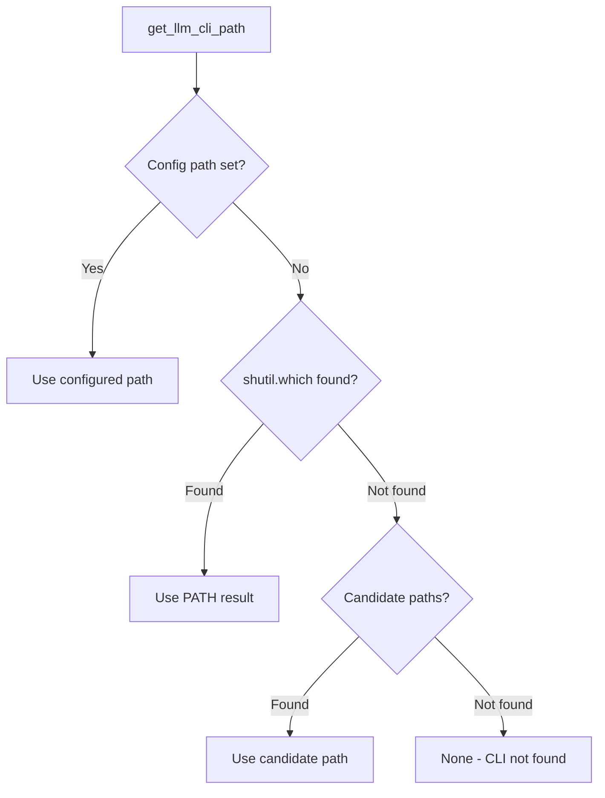

# LLM Provider Architecture

## 1. 전체 시스템 아키텍처

> **참고:** Docker 컨테이너 내부에는 Claude/Codex CLI가 설치되어 있지 않음.
> Provider가 `subprocess`로 CLI를 호출하므로, 호스트에 CLI가 설치되어 있어야 동작.

---

## 2. LLM Provider 클래스 구조

---

## 3. Provider 라우팅 흐름

---

## 4. 트레이딩 사이클 세션 시퀀스

---

## 5. CLI 호출 상세

### Claude Code CLI

### Codex CLI

---

## 6. CLI 경로 탐색 순서

탐색 후보 경로:
- `/opt/homebrew/bin/claude` | `/opt/homebrew/bin/codex`
- `/usr/local/bin/claude` | `/usr/local/bin/codex`
- `~/.local/bin/claude` | `~/.local/bin/codex`
- `~/.npm-global/bin/claude` | `~/.npm-global/bin/codex`
