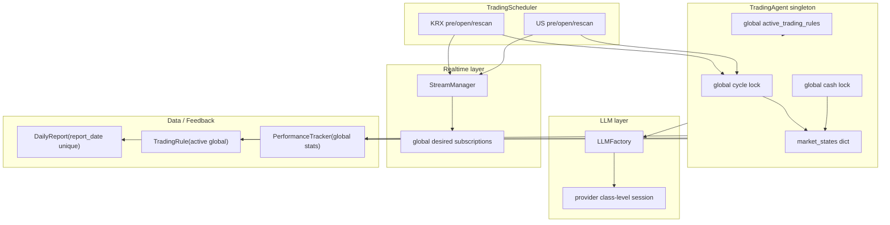
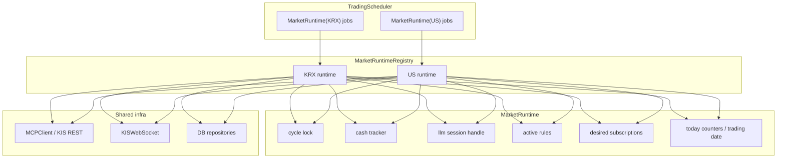
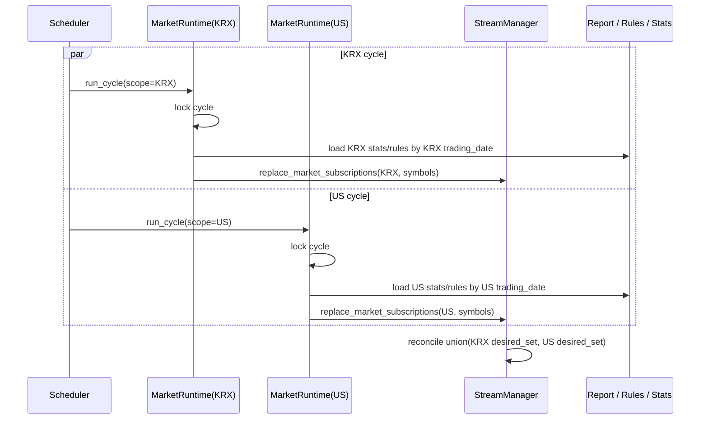

# Multi-Market Session Bot Improvement Plan

## Summary

현재 구조는 `market_profile`, `market_calendar`, `MarketState` 같은 시장 인지형 경계는 잘 잡혀 있다. 하지만 실제 런타임 자원은 아직 전역 싱글톤 중심이라서, 국내주식 세션과 해외주식 세션이 완전히 독립된 봇처럼 동작하지는 않는다.

핵심 개선 방향은 다음 네 가지다.

1. 전역 실행 상태를 시장별 런타임으로 분리한다.
2. 리포트/피드백/리스크 통계를 시장 스코프와 시장 현지 날짜 기준으로 재설계한다.
3. 실시간 구독을 전역 desired set이 아니라 시장별 desired set으로 관리한다.
4. 멀티마켓 경계를 회귀 테스트와 운영 지표로 고정한다.

이 문서는 `KRX` 와 `US` 를 독립된 세션 봇으로 운영하는 것을 목표로 한다. 여기서 `US` 는 스케줄링/리포트/리스크 관점의 시장 그룹이고, 실제 종목 라우팅은 `NASDAQ` / `NYSE` / `AMEX` 를 그대로 유지한다.

## Current Architecture

### Current Structural Problems

- `TradingAgent.run_cycle()` 가 단일 cycle lock 으로 직렬화되어 시장 간 동시 실행이 막힌다.
- LLM 세션이 provider 클래스 레벨 전역 상태라서 국내/해외 컨텍스트가 섞일 수 있다.
- `StreamManager.update_subscriptions()` 가 전체 구독 집합을 치환하는 방식이라 한 시장의 재스캔이 다른 시장 구독을 지울 수 있다.
- `DailyReport`, `TradingRule`, `PerformanceTracker`, 일일 거래 횟수 집계가 시장 스코프를 갖지 않아 피드백과 리스크가 서로 오염된다.
- 일부 일일 통계는 `now_kst()` 기준이라 미국장처럼 KST 자정을 넘는 세션에서 하루 경계가 잘못 계산된다.

## Target Architecture

### Design Defaults

- 런타임 스코프는 `KRX` 와 `US` 두 개로 나눈다.
- 종목/주문/보유 데이터는 기존처럼 `KRX`, `NASDAQ`, `NYSE`, `AMEX` 를 유지한다.
- 리포트/피드백/리스크 집계는 `market_scope` 와 `trading_date` 를 기본 키로 삼는다.
- `trading_date` 는 KST가 아니라 `market_calendar.market_date(market=...)` 기준으로 계산한다.

## Improvement Workstreams

### 1. Market Runtime 분리

- `TradingAgent` 의 전역 `_cycle_lock`, `_cash_lock`, `_active_trading_rules` 를 `MarketRuntime` 내부 상태로 이동한다.
- `MarketState` 는 읽기용 컨텍스트가 아니라 `MarketRuntime` 의 일부로 편입한다.
- `run_cycle(market)` 는 `runtime = registry.get(scope)` 를 통해 해당 시장 런타임만 잠근다.
- 실시간 이벤트 경로도 동일한 runtime 을 사용해 현금, LLM 세션, 활성 규칙을 공유하게 만든다.

### 2. LLM 세션 분리

- `LLMFactory.start_session/end_session/pause_session/resume_session` 에 `scope` 파라미터를 추가한다.
- provider 클래스 레벨 전역 세션 대신 `scope -> session_id` 매핑을 관리한다.
- 장중 스캔 세션과 장외 리뷰 세션은 같은 시장 내에서도 목적이 다르므로 `scope + phase` 로 세분화할 수 있게 설계한다.
- 실시간 이벤트 분석은 장중 스캔 세션에 무조건 편승하지 않고, 별도 ephemeral 호출 또는 `scope=market, phase=event` 정책으로 명시한다.

### 3. Realtime Subscription 분리

- `StreamManager.update_subscriptions()` 는 제거하거나 내부 전용으로 축소한다.
- 대신 `replace_market_subscriptions(scope, symbols)` 와 `add_symbol(scope, symbol)` 형태로 API 를 바꾼다.
- 내부적으로는 `scope -> desired_set` 을 저장하고, 실제 WebSocket 구독은 전체 scope 의 union 으로 reconcile 한다.
- `KRX` 재스캔은 `KRX desired_set` 만 바꾸고, `US desired_set` 은 절대 건드리지 않게 한다.
- 구독 상한은 전역 41인지 소켓별 41인지 정책을 명시하고, 구현도 그 정책에 맞춘다.

### 4. Report / Feedback / Risk 집계 분리

- `DailyReport` 는 `report_date` 단일 unique 를 버리고 `(market_scope, report_date)` unique 로 바꾼다.
- `TradingRule` 에도 `market_scope` 를 추가해 `KRX` 규칙과 `US` 규칙을 분리한다.
- `PerformanceTracker` 메서드에 `market_scope` 필터를 추가한다.
- `_get_today_trade_count()` 와 `_get_today_trade_stats()` 는 `market_scope` 와 `market_calendar.market_date(market)` 기준으로 계산한다.
- 하드 룰인 `get_consecutive_losses()` 역시 시장별로 분리한다.
- 프리마켓에서 불러오는 `daily_start_balance`, `lessons_learned`, `active_rules` 도 모두 runtime scope 로 저장한다.

### 5. Scheduler / Market Group 정리

- 스케줄러는 계속 `KRX`, `US` 두 그룹을 중심으로 돌린다.
- 다만 스캔 결과와 보유 종목, 주문 라우팅은 개별 시장 코드(`NASDAQ`/`NYSE`/`AMEX`)를 보존한다.
- 문서와 코드에서 `market`, `market_scope`, `exchange` 의미를 분리한다.
  - `market_scope`: 스케줄/리포트/리스크 경계
  - `market`: 종목/주문/보유의 실제 시장 코드

## Recommended Data Flow

## Migration Order

1. `MarketRuntimeRegistry` 와 시장별 runtime state 도입
2. `StreamManager` API 를 시장별 desired set 방식으로 교체
3. `DailyReport` / `TradingRule` / `PerformanceTracker` 를 시장 스코프 기반으로 마이그레이션
4. 일일 거래 통계와 하드 룰을 `market_date(market)` 기준으로 교체
5. LLM 세션을 scope 기반으로 분리
6. 멀티마켓 회귀 테스트와 운영 대시보드 추가

이 순서를 권장하는 이유는 1, 2 단계만으로도 국내/해외 실시간 구독 충돌과 전역 실행 병목을 먼저 제거할 수 있기 때문이다. 3, 4 단계는 리스크와 피드백의 정확도를 복원하는 작업이고, 5 단계는 컨텍스트 오염을 없애는 작업이다.

## Test Plan

### Runtime Isolation

- `KRX` 장중 사이클과 `US` 장중 사이클이 동시에 실행되어도 서로 `cycle_already_running` 으로 스킵되지 않는다.
- `KRX` 실시간 이벤트가 발생해도 `US` 의 현금 tracker 와 LLM 세션 상태가 변하지 않는다.

### Subscription Safety

- `KRX` 재스캔 후에도 `US` 종목 구독이 유지된다.
- `US` 보유종목 점검 후에도 `KRX` 모니터링 종목이 해지되지 않는다.

### Reporting and Feedback

- 같은 달력일에도 `KRX` 와 `US` 는 각각 별도 `DailyReport` 를 생성한다.
- `KRX` 손실 연속 기록이 `US` 하드 룰 차단 조건에 영향을 주지 않는다.
- `US` 시장이 KST 자정을 넘어도 동일한 NY 거래일 내에서는 일일 거래 횟수가 이어진다.

### Acceptance Criteria

- `KRX` 와 `US` 가 동시에 활성화되어도 실시간 구독 수가 시장 간 교차 삭제되지 않는다.
- Admin 에서 `KRX` 와 `US` 리포트, 금일 거래 수, 손익률이 서로 다른 값으로 안정적으로 보인다.
- 운영 로그에서 모든 주요 상태가 `market_scope` 와 `trading_date` 를 함께 기록한다.

## Non-Goals

- 이번 개선안은 전략 로직 자체를 바꾸는 문서가 아니다.
- `NASDAQ` / `NYSE` / `AMEX` 를 각자 별도 스케줄러로 완전히 분리하는 단계까지는 포함하지 않는다.
- 주문 라우팅이나 KIS API 명세를 바꾸는 작업은 이 문서의 주제가 아니다.
