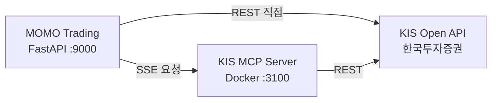
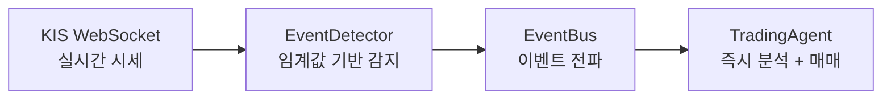

# 주식(KRX) 시스템 상세

> 일반 개요는 [README](../README.md), 코드 레벨 아키텍처는 [architecture.md](architecture.md)를 참조하세요.

---

## 1. KIS Open API 연동 구조

주식 매매는 한국투자증권(KIS) Open API를 통해 이루어집니다. 두 가지 연동 방식을 사용합니다:

| 방식 | 용도 | 파일 |
|------|------|------|
| **MCP Server (Docker)** | 주문 실행, 잔고 조회, 현재가 등 핵심 API | `trading/mcp_client.py` |
| **REST API 직접 호출** | 거래량 순위, 분봉 데이터 등 MCP 미지원 기능 | `trading/kis_api.py` |

MCP Server는 Docker 컨테이너(`docker/kis-mcp/`)로 실행되며, SSE(Server-Sent Events) 프로토콜로 통신합니다.



### 계좌 설정

- `KIS_ACCOUNT_TYPE=VIRTUAL` — 모의 투자 (실제 주문 없음, 테스트용)
- `KIS_ACCOUNT_TYPE=REAL` — 실전 투자 (실제 주문 실행)
- 계좌번호는 10자리 전체 또는 CANO 8자리 + 상품코드 2자리로 설정 가능

---

## 2. 일일 스케줄 (KST)

```mermaid
gantt
    title KRX 하루 일정 (KST)
    dateFormat HH:mm
    axisFormat %H:%M

    section 장전
    사전 준비              :prep, 08:50, 10m

    section 장중
    스캔 + 매매 1          :scan1, 09:05, 25m
    보유 점검              :check1, 09:30, 5m
    보유 점검              :check2, 10:30, 5m
    스캔 + 매매 2          :scan2, 11:00, 25m
    보유 점검              :check3, 11:30, 5m
    보유 점검              :check4, 12:30, 5m
    스캔 + 매매 3          :scan3, 13:00, 25m
    보유 점검              :check5, 13:30, 5m
    매수 마감              :crit, cutoff, 14:30, 5m

    section 장마감
    강제 청산              :crit, liq, 15:10, 10m
    성적표 작성            :review, 15:40, 20m
    포트폴리오 정산         :sync, 16:00, 10m
    차트 데이터 수집        :data, 16:30, 10m
```



| 시간 | 작업 | 설명 |
|------|------|------|
| 08:50 | 사전 준비 | 전일 피드백 로드, 오버나이트 포지션 확인 |
| 09:05 | 장 시작 스캔 | 풀 스캔 → AI 종목 선정 → WebSocket 구독 |
| 11:00, 13:00 | 장중 재스캔 | 신규 기회 탐색 (adaptive 스케줄) |
| 09:30~14:30 | 보유종목 점검 | 30분~1시간 간격 손절/익절 체크 |
| 14:30 | 매수 마감 | 데이트레이딩 모드: 신규 매수 중단 |
| 15:10 | 강제 청산 | 데이트레이딩: 전량 매도 / 스윙: 종목별 HOLD/SELL 판단 |
| 15:40 | 장마감 리뷰 | 성과 분석, AI 피드백 학습, 일일 리포트 생성 |
| 16:00 | 포트폴리오 동기화 | KIS ↔ DB 잔고 대사 |
| 16:30 | 데이터 수집 | 일봉 OHLCV 저장 |

### Adaptive 재스캔

장중 재스캔은 고정 시간이 아닌 adaptive 방식으로 동작합니다:
- 매 사이클 종료 후 `schedule_hint`를 생성하여 다음 재스캔 시점을 결정
- 시장 국면, 분석 결과, 남은 현금에 따라 15~120분 간격으로 자동 조절
- 매수 마감(14:30) 이후에는 추가 재스캔 없음

---

## 3. 2-Tier LLM 분석 파이프라인

### Tier1 — 빠른 스캔 및 분석

| 용도 | 모델 (기본값) | 역할 |
|------|------------|------|
| 시장 스캔 | haiku / low effort | 거래량·등락률 데이터에서 5~8개 후보 선별 + 시장 국면 판단 |
| 종목 분석 | haiku / medium effort | 차트·기술지표 기반 BUY/HOLD 판단 + 신뢰도·목표가·손절가 |

### Tier2 — 정밀 최종 검토

| 용도 | 모델 (기본값) | 역할 |
|------|------------|------|
| 최종 검토 | sonnet / high effort | 독립적으로 Tier1 결과를 재검증, 진입가·수량·손절가 확정 |

### Fast-Path

신뢰도 80% 이상 + 강한 장세(BULL/THEME) + 일반 종목이면 Tier2를 생략하고 바로 리스크 검증으로 진행합니다.

---

## 4. 트레이딩 전략

### STABLE_SHORT (보수적)

| 항목 | 값 |
|------|-----|
| 대상 | 대형주, ETF, 저변동성 |
| 보유 기간 | 1~5일 |
| 손절 | -2%~-3% (시장 국면별) |
| 익절 | +3%~+6% (시장 국면별) |
| 최소 신뢰도 | 0.5 |

### AGGRESSIVE_SHORT (공격적)

| 항목 | 값 |
|------|-----|
| 대상 | 모멘텀 급등, 거래량 폭증 |
| 보유 기간 | 수시간~3일 |
| 손절 | -3%~-5% (시장 국면별) |
| 익절 | +6%~+12% (시장 국면별) |
| 최소 신뢰도 | 0.55 |

전략 파라미터는 시장 국면(BULL/THEME/SIDEWAYS/BEAR)에 따라 자동 조정됩니다.

### 스윙 모드

`DAY_TRADING_ONLY=false` 설정 시 오버나이트 보유가 가능합니다:
- 장마감 전 종목별 HOLD/SELL 판단
- 갭 리스크 체크
- 다음 장 시작 시 오버나이트 포지션 재평가

---

## 5. 실시간 이벤트 트레이딩

KIS WebSocket으로 실시간 시세를 받아 이벤트를 감지합니다.



| 이벤트 | 트리거 조건 | 대응 |
|--------|-----------|------|
| VOLUME_SPIKE | 거래량 급증 | 즉시 Tier1→Tier2 분석 |
| PRICE_SURGE | 가격 급등 | 즉시 분석 + 매수 판단 |
| PRICE_DROP | 가격 급락 | 즉시 분석 + 손절 판단 |
| STOP_LOSS_HIT | 손절가 도달 | 자동 매도 |
| TAKE_PROFIT_HIT | 익절가 도달 | 자동 매도 |

이벤트 기반 분석은 스케줄 재스캔과 동일한 파이프라인(`_analyze_and_trade()`)을 사용하며, 종목별 쿨다운으로 과도한 재분석을 방지합니다.

---

## 6. 리스크 관리

### 하드 게이트 (코드 레벨 자동 검증)

AI 결과와 무관하게 코드가 자동으로 차단합니다:

| 게이트 | 조건 | 설명 |
|--------|------|------|
| 신뢰도 | confidence < min_confidence | "확신이 부족하면 안 삼" |
| 손익비 (RR) | RR < 기준 (BULL 1.0, BEAR 1.2) | "기대 수익 대비 위험이 큼" |
| 손절가 | 손절가 미설정 | "안전장치 없으면 안 삼" |

### 리스크 매니저

주문 직전 최종 검증:
- 잔고 충분한지 확인
- 일일 거래 한도 초과 여부
- 종목당 최대 비중 초과 여부
- 최소 현금 비중 유지 여부

---

## 7. Admin 대시보드

`http://localhost:9000/admin`에서 실시간 모니터링 가능합니다.

- **실시간 피드** — SSE 기반 에이전트 활동 스트림 (매수/매도/분석/에러)
- **보유종목 카드** — 현재 포지션, 수익률, 미실현 손익
- **미체결 주문** — 대기 중인 주문 현황
- **일일 리포트** — 승률, 손익, AI 학습 내용
- **설정 패널** — 런타임 설정 변경 (재시작 불필요)
- **수동 트리거** — 장 외 시간에도 사이클 실행 가능

---

## 8. 프로젝트 구조

```
momo-trading/
├── main.py                     # FastAPI 앱 진입점
├── core/                       # 설정, DB, 이벤트버스, 로깅
├── models/                     # SQLAlchemy ORM 모델
├── repositories/               # AsyncBaseRepository[T] CRUD
├── services/                   # 비즈니스 로직
├── schemas/                    # Pydantic DTO
├── api/routes/                 # REST API 엔드포인트
├── dependencies/               # DI 팩토리 + Type Alias
├── exceptions/                 # ServiceException + ErrorCode
│
├── agent/                      # AI 트레이딩 에이전트
│   ├── trading_agent/          # Mixin 기반 메인 에이전트
│   ├── market_scanner.py       # 시장 스캔 + LLM 스크리닝
│   ├── crypto_scanner.py       # 코인 전용 스캐너
│   └── decision_maker.py       # 매매 실행 로직
│
├── strategy/                   # 전략 엔진
│   ├── stable_short.py         # 보수적 단타 (대형주, 5일)
│   ├── aggressive_short.py     # 공격적 모멘텀 (3일)
│   ├── risk_manager.py         # 리스크 관리
│   └── holding_policy.py       # 오버나이트 보유 정책
│
├── analysis/                   # AI 분석
│   ├── llm/                    # LLM 팩토리 + 프롬프트
│   ├── technical/              # 기술적 분석 (RSI, MACD, BB)
│   └── feedback/               # 성과 추적 + 학습 규칙
│
├── trading/                    # 증권사 연동
│   ├── mcp_client.py           # KIS MCP SSE 클라이언트
│   ├── kis_api.py              # KIS REST API 직접 호출
│   ├── bithumb_client.py       # 빗썸 REST API 클라이언트
│   └── account_manager.py      # 잔고/보유/주문 조회
│
├── realtime/                   # 실시간 모니터링
│   ├── monitor.py              # KIS WebSocket 리스너
│   ├── coin_monitor.py         # 빗썸 WebSocket 리스너
│   └── event_detector.py       # 이벤트 감지 (급등/급락/거래량)
│
├── scheduler/                  # APScheduler 잡 관리
├── admin/static/               # Admin 대시보드 (HTML/JS)
├── backtesting/                # 백테스팅 엔진
├── docker/kis-mcp/             # KIS MCP Docker 설정
├── alembic/                    # DB 마이그레이션
└── tests/                      # pytest 테스트
```
