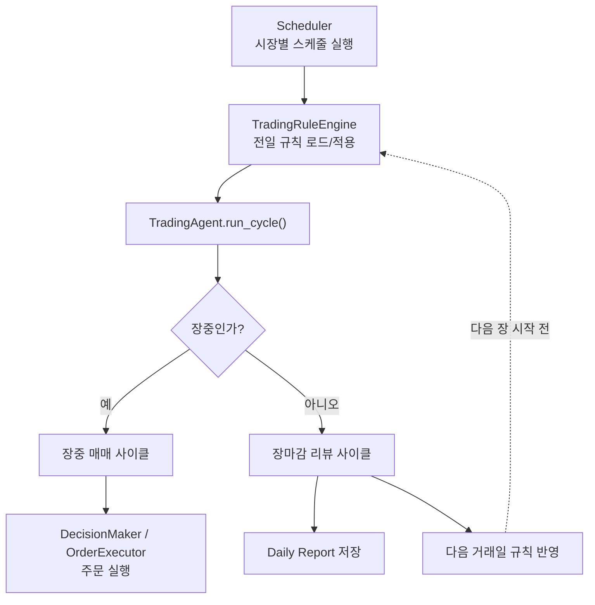
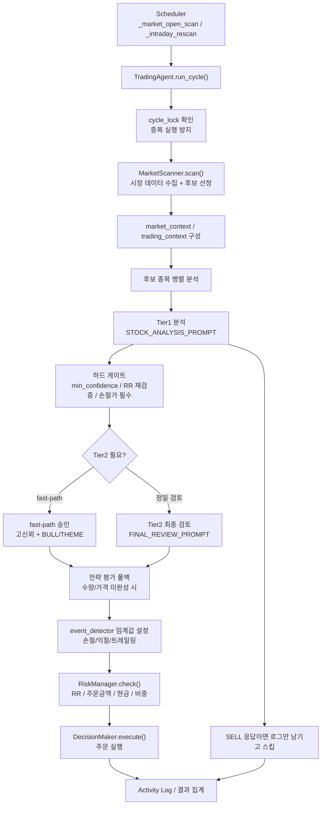
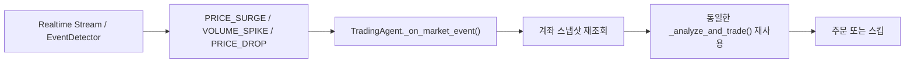
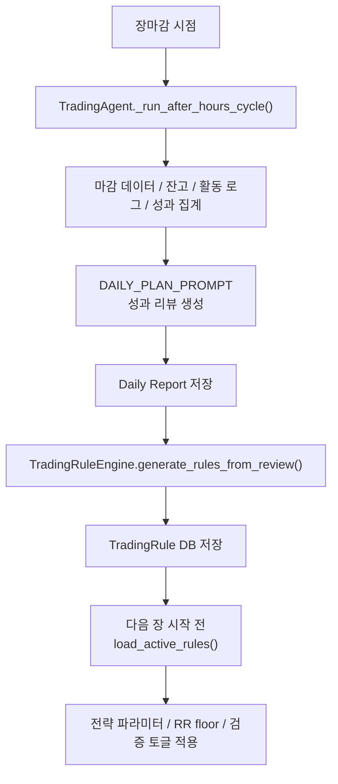
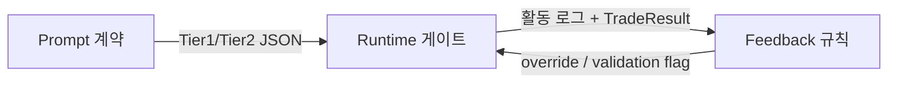

# Trading Agent Architecture

이 문서는 `momo-trading`의 최종 에이전트 구조를 트레이딩 실행 관점에서 설명한다.
핵심은 `언제 시작되는가`, `무슨 기준으로 걸러지는가`, `어디서 주문이 실행되는가`, `장마감 피드백이 다음날 어떻게 반영되는가`이다.

## 1. 한눈에 보는 전체 구조

## 2. 장중 매매 파이프라인

### 장중 루프에서 중요한 포인트

- 시장 스캔은 `MarketScanner`가 한 번의 Tier1 호출로 `시장 국면 판단 + 후보 종목 선정`을 함께 수행한다.
- 각 종목은 병렬로 분석되지만, 같은 사이클 안에서는 동일한 `market_context`와 `trading_context`를 공유한다.
- Tier1 스캔 경로는 매수 기회 탐색 전용이다.
  - 프롬프트는 `BUY/HOLD`를 요청한다.
  - 런타임은 방어적으로 `SELL`도 받아서 즉시 스킵한다.
- Tier1 직후 코드 레벨 게이트가 먼저 작동한다.
  - `min_confidence`
  - `revalidate_rr_ratio`
  - `require_stop_loss_logging`
- Tier2가 수량과 진입가를 완성하면 AI 결정을 우선 사용한다.
- Tier2가 수량을 주지 않으면 전략 클래스(`STABLE_SHORT`, `AGGRESSIVE_SHORT`)가 수량/가격을 보완한다.
- 최종 주문 직전에는 반드시 `RiskManager`가 다시 RR, 주문 금액, 현금, 비중을 검증한다.

## 3. 실시간 이벤트 재진입 구조

- 실시간 이벤트 경로도 장중 스캔과 같은 `_analyze_and_trade()`를 사용한다.
- 즉, `Tier1 → 하드 게이트 → Tier2/fast-path → RiskManager → 주문` 구조가 동일하다.
- 이벤트 경로에는 종목별 쿨다운과 중복 분석 방지 세트가 있어 과도한 재분석을 막는다.

## 4. 장마감 피드백 루프

### 장마감 루프에서 일어나는 일

- 에이전트는 장마감 후 하루의 활동 로그, 주문 결과, 성과 요약, 오버나이트 포지션 상태를 모은다.
- LLM은 `today_review`, `success_patterns`, `failure_patterns`, `action_items`를 만든다.
- `action_items`는 바로 주문에 쓰이지 않고 `TradingRule`로 변환되어 저장된다.
- 다음 거래일 시작 전에 스케줄러가 활성 규칙을 읽어 전략 인스턴스와 리스크 매니저에 적용한다.
- 이 구조 덕분에 `오늘의 실수`가 `내일의 코드 레벨 강제 규칙`으로 이어진다.

## 5. 계약 관점 핵심 정리

- 프롬프트는 구조화된 JSON을 요구한다.
- 런타임은 그 JSON을 그대로 신뢰하지 않고 다시 검증한다.
- 리뷰 피드백은 문장으로 끝나지 않고, 다음 사이클의 하드 게이트 값으로 돌아온다.
- 현재 RR 기본 정책은 다음과 같다.
  - `THEME/BULL = 1.0`
  - `SIDEWAYS/BEAR = 1.2`
- Tier1/Tier2의 `confidence`는 `손절 전에 목표가에 도달할 확률`로 해석한다.

## 6. 주요 파일 맵

- `scheduler/scheduler.py`
  - 시장 오픈, 장중 재스캔, 장마감 리뷰 트리거
- `agent/trading_agent.py`
  - 장중/장외 메인 오케스트레이션
- `agent/market_scanner.py`
  - 시장 데이터 수집, 후보 종목 선별
- `strategy/risk_manager.py`
  - 최종 주문 직전 리스크 게이트
- `analysis/feedback/trading_rules.py`
  - 장마감 리뷰를 코드 레벨 규칙으로 변환
- `trading/risk_policy.py`
  - 프롬프트와 런타임이 공유하는 RR 기본 정책
